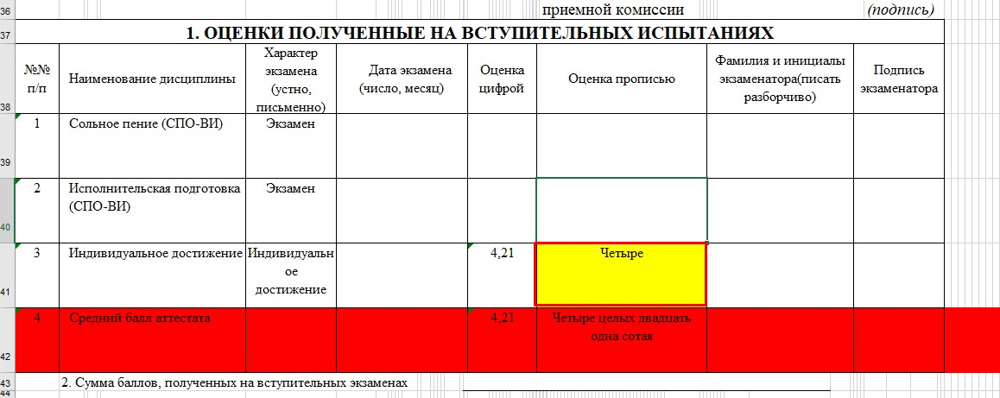

# Инструкция для работы с Markdown

## Выделение текста

Для выделения текста курсивом обрамляем его звездочками(*) или знаком нижнего подчеркивания. Например, *вот* или _вот_

Для выделения текста полужирным обрамляем его двойными звездочками(**) или двойным знаком нижнего подчеркивания. Например, **вот так** или __вот так__

Альтернативные способы выделения текста жирным или курсивом нужны для совмещения. Например, _текст выделен курсивом и **полужирным**_

## Списки

Чтобы добавить ненумерованные списки, необходимо выделить пункты звездочкой(*). Например, так:
* первый элемент
* второй элемент
* и так далее ...

Чтобы добавить нумерованные списки, необходимо пронумеровать пункты. Например, так:
1. Первый пункт
2. Второй пункт
3. и так далее ...

## Работа с изображениями

Чтобы вставить изображение в текст, необходимо написать следующее:

## Ссылки

[ссылка](http://https://orpheusradio.ru/player/66/ "Радио Орфей")

## Работа с таблицами

## Цитаты

## Заключение